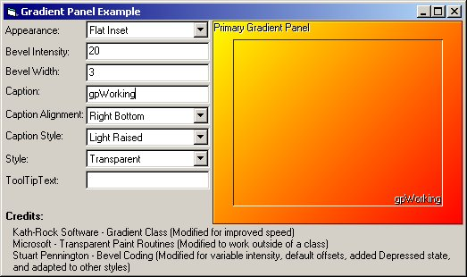



## Gradient Panel v1\.0\.0

### Description

This is a custom container control which has 9 different caption alignments, 6 caption styles, 8 appearances, and 4 styles including transparent. I've tried to make this as bug free as possible, but I can't guarantee that it is. I'm always looking for suggestions, comments, and/or criticism so feel free to leave any. Enjoy!
 
### More Info
 

             |
---                |---
**Submitted On**   |2001-02-28 20:06:48
**By**             |[Stephen Kent](https://github.com/Planet-Source-Code/PSCIndex/blob/master/ByAuthor/stephen-kent.md)
**Level**          |Intermediate
**User Rating**    |5.0 (25 globes from 5 users)
**Compatibility**  |VB 6\.0
**Category**       |[Custom Controls/ Forms/  Menus](https://github.com/Planet-Source-Code/PSCIndex/blob/master/ByCategory/custom-controls-forms-menus__1-4.md)
**World**          |[Visual Basic](https://github.com/Planet-Source-Code/PSCIndex/blob/master/ByWorld/visual-basic.md)
**Archive File**   |[CODE\_UPLOAD15632312001\.zip](https://github.com/Planet-Source-Code/stephen-kent-gradient-panel-v1-0-0__1-21413/archive/master.zip)

